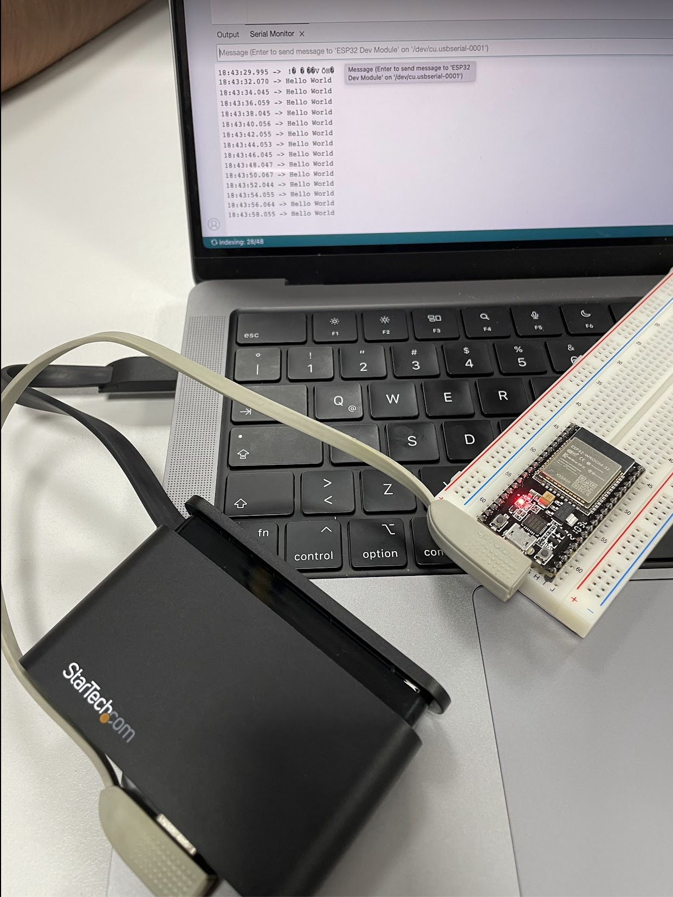

# Práctica 1 - Instalar Arduino y probar el ESP32

En esta práctica instalaremos desde cero Arduino, la librería del ESP32 y el
primer programa "Hello World" en nuestra placa de desarrollo.

## Foto del ESP32 conectado a la computadora

## Código del programa

[practica1.ino](practica1.ino)
