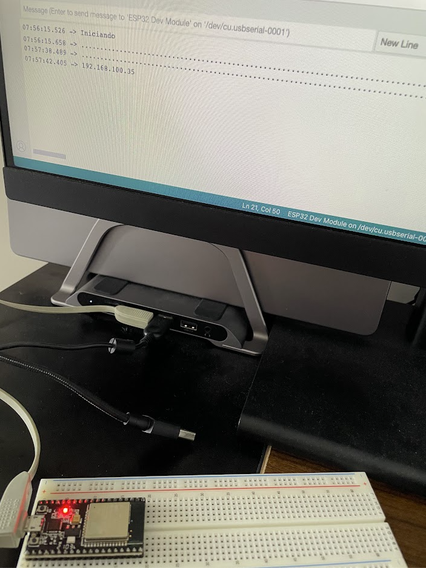
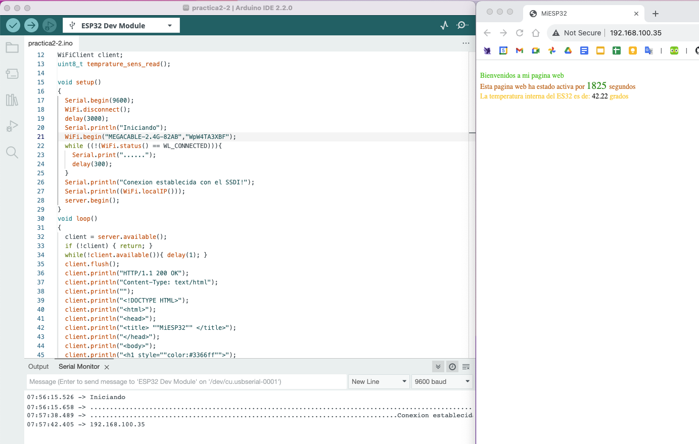

# Práctica 2- Conociendo el led interno, el sensor interno y servidor web del ESP32

En esta práctica aprendemos:

1. Prender y apagar el led interno del ESP32, escribir la temperatura interna del ESP32 en el monitor serial

    [Código](./practica2-1/practica2-1.ino)

    [Video](https://photos.app.goo.gl/i5soALeWznu8G23Y7)

2. Usar el ESP32 como servidor web

    [Código](./practica2-2/practica2-2.ino)

    

    

3. Opciones para alimentar el ESP32 cuando esta conectado a wifi
    
    Para este paso utilizamos el mismo código del paso anterior

    [Video](https://photos.app.goo.gl/XUuWdxbz1z5Cz9MC8)

4. Prender y apagar el led interno del ESP32 desde el servidor web

5. Prender y apagar un led externo desde el servidor web ESP32
